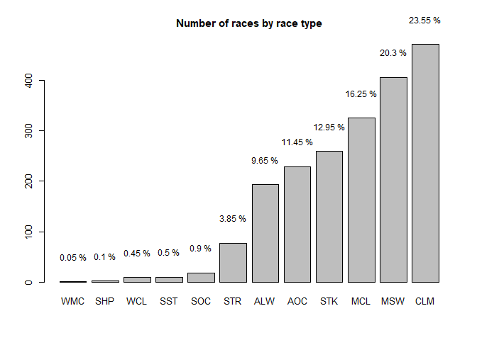
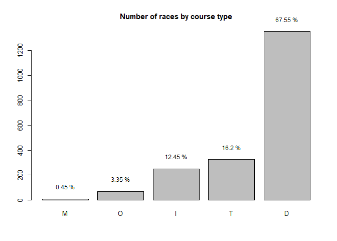
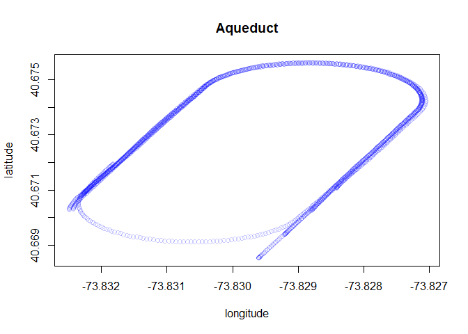
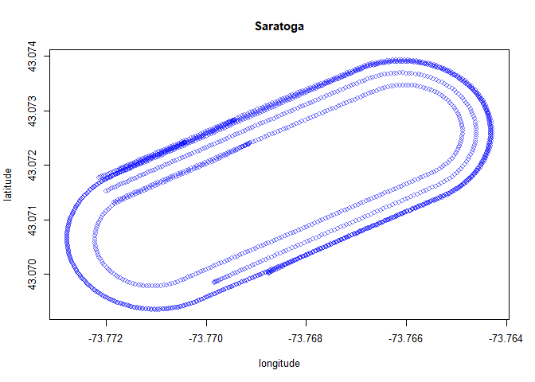
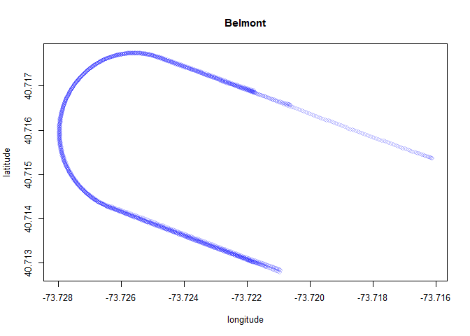
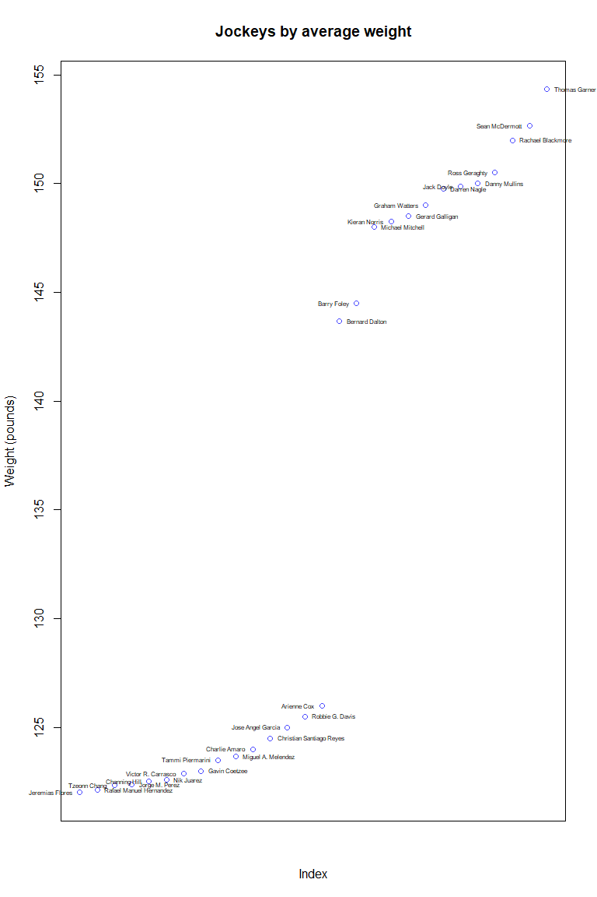
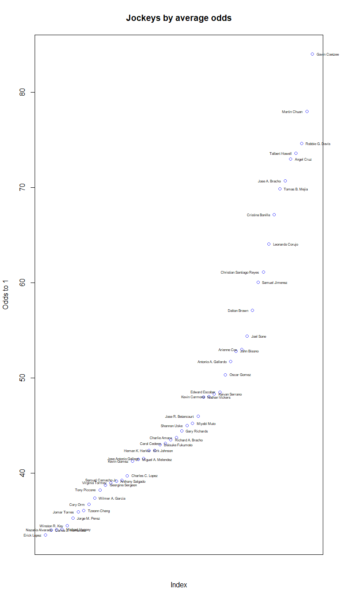
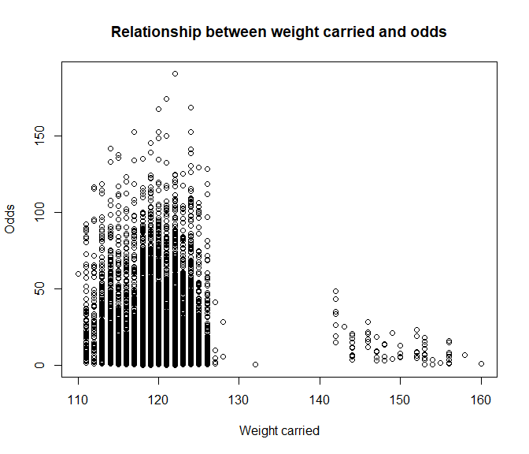

 

## Race Types

  There are 4 main types of races, and each race is a variant of one
of these:

 

#### Maiden

Any horse who has never won a race is known as a maiden. To win that
first race is known as “breaking his/her maiden” and while this is
usually done in a maiden race, it can happen in any type of race.

#### Claiming

In a claiming race, every horse has a price tag and the horse can be
bought or “claimed” out of the race for that price. The horse must be
claimed BEFORE the race takes place. In other words, the outcome of the
race has no bearing on whether or not the horse will be claimed. If a
horse is claimed, the old owner still gets any purse money, but the new
owner gets the horse.

#### Allowance

In an allowance race, horses are not for sale and the purses are
generally higher. These races have set conditions and weights to carry
with weight “allowed” off for meeting other conditions.There are usually
allowances such as 5 pounds off the assigned weight if the horse hasn’t
won since a certain date or hasn’t won a certain amount of money.

#### Stakes

Stakes races are the major leagues of horse racing featuring only the
top horses. They have the highest purses from a few thousand at small
local tracks to $10 million at the Dubai World Cup.

While the difference in grades can be significant, stakes races are
among the hardest for most people to handicap. The reason is that all
horses in a stakes race are excellent horses and if a non-favorite horse
is having a good day, they can blow away the track. A good example of
this is the Kentucky Derby where the favorite very seldom wins.

 

#### Variants

 

-   **AOC : Allowance/Optional Claiming**

    This race type combines features associated with two traditional
    race types, Allowance and Claiming races. Horses may be entered
    under Allowance conditions (not eligible to be claimed, but must
    qualify for the conditions of the race) OR entered for a claiming
    price if they do not qualify for the race conditions.

-   **WCL : Waiver Claiming**

    A claiming race where one or more participants is allowed to race
    without the possibility of being claimed after coming off an
    extended layoff and is running in a claiming race that has a
    claiming price equal to or greater than their last start in a
    claiming race.

-   **WMC : Waiver Maiden Claiming**

    A claiming race for non-winners where one or more participants is
    allowed to race without the possibility of being claimed after
    coming off an extended layoff and is running for a claiming race
    that has a claiming price equal to or greater than their last start
    in a claiming race.

-   **SST : Starter Stakes**

    This stakes race is limited to horses that have started for a
    specific claiming price or less in a specified timeframe.

-   **SHP : Starter Handicap**

    This category is reserved for horses that have been running in
    inferior claiming company, but have improved to the point that they
    would not be risked being sold in a claiming race. In effect this
    race is an allowance race restricted to horses that have previously
    run in a claiming race at a specific level (e.g. starters for a
    claiming price of $5,000). In a starter handicap race, horses are
    weighted similar to a handicap race.

-   **STR :Starter Allowance**

    Starter allowance races are identical to starter handicap races with
    the only difference that horses competing in this race are weighted
    through allowance conditions (i.e. number of races or money won).

-   **SOC : Starter/Optional Claiming**

    This race type is another hybrid of two race types, Starter
    Allowance and Claiming. To run as an “allowance horse” (not eligible
    to be claimed), the horse must have started for a specified claiming
    price or less in a specified timeframe. Horses not eligible under
    the Starter Allowance conditions may run, but they must compete for
    the claiming price.

-   **MCL : Maiden Claiming**

    Maiden claiming races are for horses that have never won a race and
    are eligible to be claimed

-   **MSW : Maiden Special Weight**

    These races are reserved for horses that have never won a race. They
    are not eligible to be claimed. The term special weight is derived
    from the fact that arbitrary weights are assigned to horses by age.
    (e.g. 3 year olds 118 pounds, older 122 pounds.)

  

#### Race types held on each track

<table>
<colgroup>
<col style="width: 5%" />
<col style="width: 7%" />
<col style="width: 7%" />
<col style="width: 7%" />
<col style="width: 7%" />
<col style="width: 7%" />
<col style="width: 8%" />
<col style="width: 7%" />
<col style="width: 8%" />
<col style="width: 7%" />
<col style="width: 7%" />
<col style="width: 7%" />
<col style="width: 8%" />
</colgroup>
<thead>
<tr class="header">
<th style="text-align: left;"></th>
<th style="text-align: left;">ALW</th>
<th style="text-align: left;">AOC</th>
<th style="text-align: left;">CLM</th>
<th style="text-align: left;">MCL</th>
<th style="text-align: left;">MSW</th>
<th style="text-align: left;">SHP</th>
<th style="text-align: left;">SOC</th>
<th style="text-align: left;">SST</th>
<th style="text-align: left;">STK</th>
<th style="text-align: left;">STR</th>
<th style="text-align: left;">WCL</th>
<th style="text-align: left;">WMC</th>
</tr>
</thead>
<tbody>
<tr class="odd">
<td style="text-align: left;">AQU</td>
<td style="text-align: left;">TRUE</td>
<td style="text-align: left;">TRUE</td>
<td style="text-align: left;">TRUE</td>
<td style="text-align: left;">TRUE</td>
<td style="text-align: left;">TRUE</td>
<td style="text-align: left;">TRUE</td>
<td style="text-align: left;">TRUE</td>
<td style="text-align: left;">TRUE</td>
<td style="text-align: left;">TRUE</td>
<td style="text-align: left;">TRUE</td>
<td style="text-align: left;">TRUE</td>
<td style="text-align: left;">FALSE</td>
</tr>
<tr class="even">
<td style="text-align: left;">BEL</td>
<td style="text-align: left;">TRUE</td>
<td style="text-align: left;">TRUE</td>
<td style="text-align: left;">TRUE</td>
<td style="text-align: left;">TRUE</td>
<td style="text-align: left;">TRUE</td>
<td style="text-align: left;">FALSE</td>
<td style="text-align: left;">TRUE</td>
<td style="text-align: left;">FALSE</td>
<td style="text-align: left;">TRUE</td>
<td style="text-align: left;">TRUE</td>
<td style="text-align: left;">TRUE</td>
<td style="text-align: left;">TRUE</td>
</tr>
<tr class="odd">
<td style="text-align: left;">SAR</td>
<td style="text-align: left;">TRUE</td>
<td style="text-align: left;">TRUE</td>
<td style="text-align: left;">TRUE</td>
<td style="text-align: left;">TRUE</td>
<td style="text-align: left;">TRUE</td>
<td style="text-align: left;">FALSE</td>
<td style="text-align: left;">TRUE</td>
<td style="text-align: left;">FALSE</td>
<td style="text-align: left;">TRUE</td>
<td style="text-align: left;">TRUE</td>
<td style="text-align: left;">TRUE</td>
<td style="text-align: left;">FALSE</td>
</tr>
</tbody>
</table>

   

## Course types

 

### Turf

Provided there is a good balance of rain and sun through the year turf
is the ideal to run races on. Turf provides a cushioned surface for
horses to land on (depending on the going) that makes it perfect for
both jump and flat racing. It is also a fast surface with optimal
frictional properties for quick take off following landing.

While grass has many benefits for racing it is also the most variable of
surfaces with entirely different outcomes depending on whether the
ground is hard or soft.Accordingly, the characteristics of the turf is
extremely dependent on the weather. It is very hard for horses to go
flat out for long periods on grass so in general on turf courses the
strategy is to sprint in the stretches and save energy or jostle for
position in other places.

**Inner Turf**

Inner turf courses are similar to short-track Go Kart courses or
sprinting. Clever jockeys and agile colts can gain an advantage by
timing their turns properly and by gaining the inside position.

**Outer Turf**

More like long-distance running where stamina and the ability to pace
the run determine the winner.

 

### Dirt

Dirt is the fastest of all surfaces when very firm. Dirt is faster than
grass as it tends to be dryer but also because grass is slippery which
can remove some of the energy from take off’s and landings.

Commonly dirt tracks are used in areas where grass is either hard to
grow or maintain. While dirt tracks are more predictable than grass when
looking at any one specific track, variations in the mixture of dirt and
sand can make conditions very variable between tracks. The depth of the
dirt and what is underneath it too (e.g. bare ground vs asphalt) can
influence speed, drainage and other factors between different tracks.

Everyone’s heard the phrase “horses-for-courses”, and this is true of
any track types, but for dirt tracks this is very typical. Dirt does
have a serious downside, it may be the fastest surface but it is also
the most deadly.

 

### Hurdles

This course type makes up ~ .45% of all races in the data.

 

  
\#### Course types available on each track

<table>
<thead>
<tr class="header">
<th style="text-align: left;"></th>
<th style="text-align: left;">D</th>
<th style="text-align: left;">I</th>
<th style="text-align: left;">M</th>
<th style="text-align: left;">O</th>
<th style="text-align: left;">T</th>
</tr>
</thead>
<tbody>
<tr class="odd">
<td style="text-align: left;">AQU</td>
<td style="text-align: left;">TRUE</td>
<td style="text-align: left;">FALSE</td>
<td style="text-align: left;">FALSE</td>
<td style="text-align: left;">TRUE</td>
<td style="text-align: left;">TRUE</td>
</tr>
<tr class="even">
<td style="text-align: left;">BEL</td>
<td style="text-align: left;">TRUE</td>
<td style="text-align: left;">TRUE</td>
<td style="text-align: left;">TRUE</td>
<td style="text-align: left;">FALSE</td>
<td style="text-align: left;">TRUE</td>
</tr>
<tr class="odd">
<td style="text-align: left;">SAR</td>
<td style="text-align: left;">TRUE</td>
<td style="text-align: left;">TRUE</td>
<td style="text-align: left;">TRUE</td>
<td style="text-align: left;">FALSE</td>
<td style="text-align: left;">TRUE</td>
</tr>
</tbody>
</table>

   

## Track conditions (the going)

-   **YL** - Yielding

    A very wet turf course that is deep and produces slower times

-   **FM** - Firm

    A dry turf course with a slight give to it.

-   **SF** - Soft

    A turf course that contains a good amount of moisture and
    substantial give.

-   **FT** - Fast

    Dry surfaces where horses generally record their fastest times.

-   **MY** - Muddy

    A wet, deep dirt surface.

-   **SY** - Sloppy

    A dirt surface covered in water generally enough to produce
    splashing when the horses run.

-   **GD** - Good

    For grass: A relatively firm turf course containing some moisture
    and slightly more give

    For dirt: A drying out dirt surface that is producing slower times
    than a fast track would

 

When applied to either dirt or turf surfaces each of these conditions
have differing effects. Some track conditions are exclusive to a type of
surface.

 

#### Track condition and track type

<table>
<thead>
<tr class="header">
<th style="text-align: left;"></th>
<th style="text-align: right;">FM</th>
<th style="text-align: right;">FT</th>
<th style="text-align: right;">GD</th>
<th style="text-align: right;">MY</th>
<th style="text-align: right;">SF</th>
<th style="text-align: right;">SY</th>
<th style="text-align: right;">YL</th>
</tr>
</thead>
<tbody>
<tr class="odd">
<td style="text-align: left;">D</td>
<td style="text-align: right;">0</td>
<td style="text-align: right;">978</td>
<td style="text-align: right;">92</td>
<td style="text-align: right;">74</td>
<td style="text-align: right;">0</td>
<td style="text-align: right;">207</td>
<td style="text-align: right;">0</td>
</tr>
<tr class="even">
<td style="text-align: left;">I</td>
<td style="text-align: right;">181</td>
<td style="text-align: right;">0</td>
<td style="text-align: right;">55</td>
<td style="text-align: right;">0</td>
<td style="text-align: right;">2</td>
<td style="text-align: right;">0</td>
<td style="text-align: right;">11</td>
</tr>
<tr class="odd">
<td style="text-align: left;">M</td>
<td style="text-align: right;">7</td>
<td style="text-align: right;">0</td>
<td style="text-align: right;">1</td>
<td style="text-align: right;">0</td>
<td style="text-align: right;">0</td>
<td style="text-align: right;">0</td>
<td style="text-align: right;">1</td>
</tr>
<tr class="even">
<td style="text-align: left;">O</td>
<td style="text-align: right;">39</td>
<td style="text-align: right;">0</td>
<td style="text-align: right;">24</td>
<td style="text-align: right;">0</td>
<td style="text-align: right;">0</td>
<td style="text-align: right;">0</td>
<td style="text-align: right;">4</td>
</tr>
<tr class="odd">
<td style="text-align: left;">T</td>
<td style="text-align: right;">228</td>
<td style="text-align: right;">0</td>
<td style="text-align: right;">81</td>
<td style="text-align: right;">0</td>
<td style="text-align: right;">1</td>
<td style="text-align: right;">0</td>
<td style="text-align: right;">14</td>
</tr>
</tbody>
</table>

 

For all three tracks, dirt is never firm, soft or yielding. Turf on the
other hand is never fast, muddy or sloppy.

   

### Shapes of the three tracks

   

### Races by track and season

<table>
<thead>
<tr class="header">
<th style="text-align: left;"></th>
<th style="text-align: right;">fall</th>
<th style="text-align: right;">spring</th>
<th style="text-align: right;">summer</th>
<th style="text-align: right;">winter</th>
</tr>
</thead>
<tbody>
<tr class="odd">
<td style="text-align: left;">AQU</td>
<td style="text-align: right;">190</td>
<td style="text-align: right;">245</td>
<td style="text-align: right;">0</td>
<td style="text-align: right;">390</td>
</tr>
<tr class="even">
<td style="text-align: left;">BEL</td>
<td style="text-align: right;">324</td>
<td style="text-align: right;">29</td>
<td style="text-align: right;">419</td>
<td style="text-align: right;">0</td>
</tr>
<tr class="odd">
<td style="text-align: left;">SAR</td>
<td style="text-align: right;">262</td>
<td style="text-align: right;">0</td>
<td style="text-align: right;">141</td>
<td style="text-align: right;">0</td>
</tr>
</tbody>
</table>

   

## Jockeys

